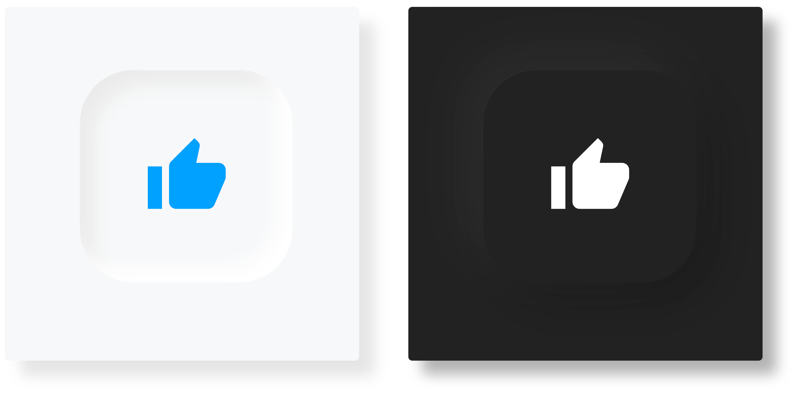

# Lovelace Soft UI

> Simple yet functional, “Neumorphic” Lovelace package.


## Overview

This is not a theme. It is a collection of custom card configurations and a set of custom styling applied through card-mod.
We love to help on the [community forums](https://community.home-assistant.io/t/lovelace-soft-ui-simple-and-clean-lovelace-configuration) or the issues tab and welcome any new contributions.
Some other great alternatives:

- [**`Savjee`**](https://github.com/Savjee)/[`button-text-card`](https://github.com/Savjee/button-text-card)

- [**`KTibow`**](https://github.com/KTibow)/[`lovelace-light-soft-ui-theme`](https://github.com/KTibow/lovelace-light-soft-ui-theme/)

## Installation

#### `1. Install card-mod 🔹`

[`card-mod`](https://github.com/thomasloven/lovelace-card-mod) is needed to style the cards.
It available via [HACS](https://hacs.xyz).

#### `2. Custom themes 🎨`

The shadows are coded to be used in a light theme and a dark theme.
The card will automatically switch between the light and dark shadow based on the state of the `sun.sun` entity.

They will work with the default Home Assistant themes. However, this style works best with custom themes.
Many themes are available on HACS, the ones used in the screenshots are the [`clear`](https://github.com/naofireblade/clear-theme) and [`slate`](https://github.com/seangreen2/slate_theme) theme.

#### `3. Theme automation 🌗`

Now that we have a custom light & dark theme, we have to tell Home Assistant to automatically switch between them at sunset and sunrise.
There are three ways to do this:

- <details>
    <summary><code><i>Automation</i> 🤖</code></summary>

  Add the following to your `automations.yaml`

  ```yaml
  # Example automations.yaml entry
  - id: set_theme
    alias: Set Theme
    trigger:
      - platform: state
        entity_id: sun.sun
    action:
      - choose:
          - conditions:
              - condition: state
                entity_id: sun.sun
                state: "above_horizon"
            sequence:
              - service: frontend.set_theme
                data:
                  name: name of your light theme
          - conditions:
              - condition: state
                entity_id: sun.sun
                state: "below_horizon"
            sequence:
              - service: frontend.set_theme
                data:
                  name: name of your dark theme
  ```

  </details>

- <details>
  <summary><code>Blueprint 📐</code></summary>

  Import this [Blueprint](https://community.home-assistant.io/t/light-dark-theme-switcher-based-on-sun/255455)

  </details>

- <details>
  <summary><code>Built-in ⚙️</code></summary>

  _This is **not** the recommended method.
  Only use if your device and browser support dark mode detection, and you are on Home Assistant 0.114 or above._

  In the sidebar, select `Developer Tools` and then navigate to the `SERVICES` tab and select `frontend.set_theme` from the service dropdown.
  In the `Service Data` field, enter the following. You will have to call the service twice, once for your light theme and once for your dark theme.

  ```yaml
  name: name of your theme
  mode: light # or dark
  ```

  </details>

#### `Done 🎉`

Cheers! Add the following to _any_ card configuration to style it with Soft UI.

```yaml
# Example entry
style: |
  ha-card {
      box-shadow:
        
          -5px -5px 15px #ffffff, 5px 5px 15px #ebebeb;
        
          -5px -5px 15px #2c2c2c, 5px 5px 15px #191919;
        
      margin: 10px;
      border-radius: 15px;
      background-color: var(--primary-background-color);
   }
```

## Cards

Add the following cards using the Lovelace UI.

`Three dots on the top right` > `Edit Dashboard` > `+ ADD CARD` > `Manual` > Paste code

### Text Cards

#### `Heading`

> Get card [here](cards/text/heading.yaml)


#### `Heading Subheading`

> Get card [here](cards/text/heading_subheading.yaml)


### Button Cards

> Additionally require: [**`RomRider`**](https://github.com/RomRider)/[`button-card`](https://github.com/custom-cards/button-card)

All Button Cards can be placed in a `horizontal-stack`, `vertical-stack`, or `grid` card (as seen in the screenshots).
Inspired by [`@hawk`](https://community.home-assistant.io/u/hawk/summary)'s beautiful [dashboard](https://community.home-assistant.io/t/lovelace-soft-ui-simple-and-clean-lovelace-configuration/159357/203).

#### `Button`

> Get card [here](cards/button/button.yaml)



#### `Button Border`

> Get card [here](cards/button/button_border.yaml)


#### `Button Text`

> Get card [here](cards/button/button_text.yaml)


#### `Button Border Text`

> Get card [here](cards/button/button_border_text.yaml)


#### `Button Description`

> Get card [here](cards/button/button_description.yaml)


### Remote Card

> Additionally require: [**`RomRider`**](https://github.com/RomRider)/[`button-card`](https://github.com/custom-cards/button-card)

This card mimics a TV remote. Every single button is customizable.

#### `Simple Remote`

> Get card [here](cards/remote/remote_card.yaml)


### Thank you!

> Built with ❤️ from the `Home Assistant community`.

Maintained by [`@ilzq`](https://github.com/ilzq) & [`@KTibow`](https://github.com/KTibow).
