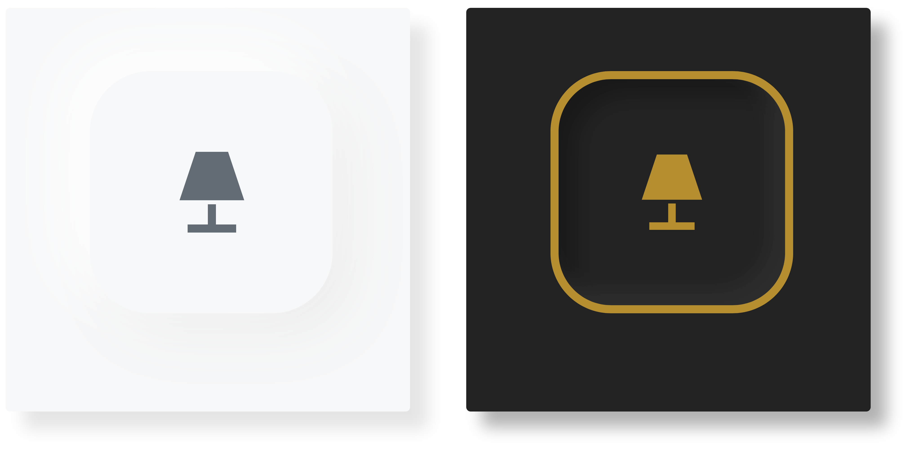
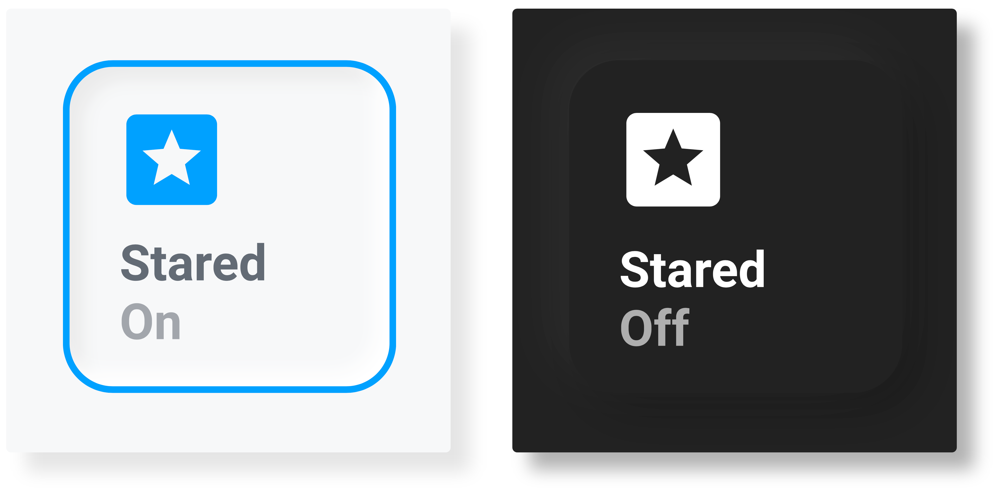
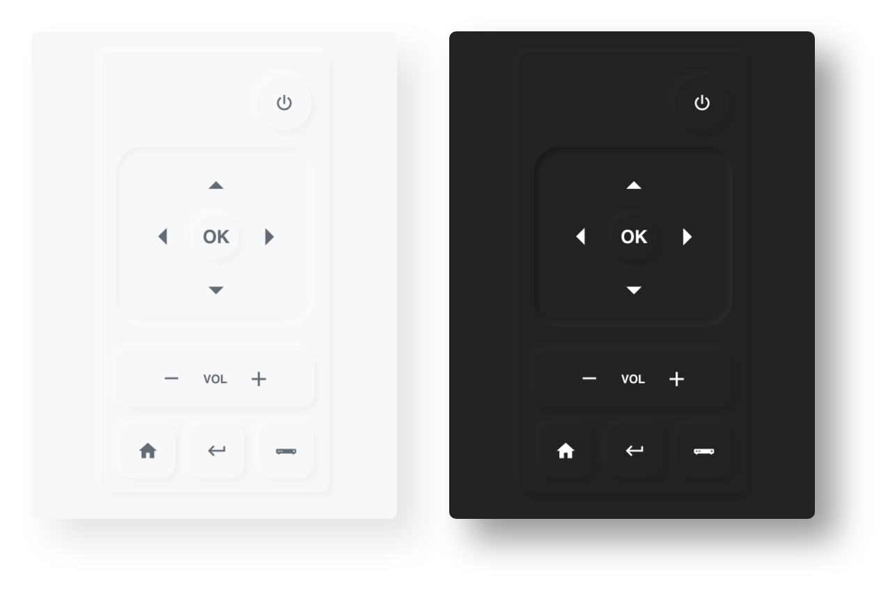

# Lovelace Soft UI 

[](https://github.com/N-l1/lovelace-soft-ui/blob/master/LICENSE) 
[](#) 
[](https://github.com/N-l1)

**Hello there!** Thank you for finding your way to my Home Assistant repo. Here you will find a simple, good looking, yet highly functional custom Neumorphic/Soft UI styled Lovelace package (with easy steps on how to set it up). Enjoy!

[**Inspiration & examples!**](docs/inspiration.md) **|** [**Questions, help & discussions**](https://community.home-assistant.io/t/lovelace-soft-ui-simple-and-clean-lovelace-configuration)


# Let's do it!

### Alternatives
**[@Savjee](https://github.com/Savjee)'s [Button Text Card](https://github.com/Savjee/button-text-card).** If you are only looking to implement this style on a button, this is the way. It is very easy to install and set up. The downside, however, is that you will not be able to implement this style on any other card.

**[@KTibow](https://github.com/KTibow)'s [Soft UI themes](https://github.com/KTibow/lovelace-light-soft-ui-theme/).** If you are looking for a quick and simple way to implement this style universally to all your cards, this is the way. KTibow's themes are easier to implement, faster to set up, and will still work with any of the custom cards inside this repo. However, using the way described in this repo provides more flexibility and customizability. 

## 1. Install card-mod
First of all, you will need to install [card-mod](https://github.com/thomasloven/lovelace-card-mod). It is a custom card available on [HACS](https://hacs.xyz) (the Home Assistant Community Store). Card-mod is what we will use to style all the cards. Please follow HACS [documentation](https://hacs.xyz) and install it.

## 2. Custom Light and Dark Themes
The cards and styling in this repo are coded with a light and dark version. The light version is used with a light theme when the sun is up and the dark version is used with a dark theme when the sun is down. Although Home Assistant provides a light and dark theme by default, this style works best with custom themes.

There are also custom themes available on [HACS](https://hacs.xyz). However, **please note that themes with pure white/black backgrounds will not work**. Light themes with a milky white background work well, and dark themes with a dark gray background work well.

All screenshots here are made with the [Clear](https://github.com/naofireblade/clear-theme) and [Slate](https://github.com/seangreen2/slate_theme) theme by [**@naofireblade**](https://github.com/naofireblade) and [**@seangreen2**](https://github.com/seangreen2) (both are available on HACS). If you decide to use the Clear theme, please make sure to remove the `lovelace-background` line from the theme's source code (located at `config/themes/clear/clear.yaml`).

## 3. Theme Automation
Now that you have custom light and dark themes, we have to tell Home Assistant to switch to them at sunset and sunrise. To do this, first, make sure that your device and browser support dark mode detection, and you are on Home Assistant 0.114 or above. If not, see the **Alternative Automation** section below. 

You will now need to make two service calls in Home Assistant. In the sidebar select Developer Tools and then navigate to the services tab and select `frontend.set_theme` from the service dropdown. In the Service Data field enter the following and modify as required. You will have to call the service twice, once for your light theme and once for your dark theme.

```yaml
name: name of your theme
mode: light # or dark
```

### Alternative Automation

Alternatively, after picking out custom light and dark themes, you can create a theme switching automation. You can import this [blueprint](https://community.home-assistant.io/t/light-dark-theme-switcher-based-on-sun/255455) or add the following into your `automations.yaml`.

<details><summary><b>Show code</b></summary>

```yaml
# Example automations.yaml entry
- id: set_theme
  alias: Set Theme
  trigger:
  - platform: homeassistant
    event: start
  - platform: state
    entity_id: sun.sun
  action:
  - choose:
    - conditions:
      - condition: state
        entity_id: sun.sun
        state: "above_horizon"
      sequence:
      - service: frontend.set_theme
        data:
          name: Change this to the name of your light theme
    - conditions:
      - condition: state
        entity_id: sun.sun
        state: "below_horizon"
      sequence:
      - service: frontend.set_theme
        data:
          name: Change this to the name of your dark theme
```
</details>

## Done!
We are done! Add this code to any card config to style it with Soft UI. 

```yaml
# Example entry
style: |
  ha-card {
      background-color: var(--primary-background-color);
      border-radius: 15px;
      margin: 10px;
      box-shadow:
        
          -4px -4px 8px rgba(255, 255, 255, .5), 5px 5px 8px rgba(0, 0, 0, .03);
        
          -5px -5px 8px rgba(50, 50, 50, .2), 5px 5px 8px rgba(0, 0, 0, .08);
        
   }
```

# Cards
Here are some cards created using this style. Add them using the UI. Click on the three dots on the top right, go to `Configure UI`, then click on the `+` on the bottom right, and select `Manual`. Paste in the appropriate code for each card.

## Text Cards
Text cards are great ways to label things. It can help you define sections inside your UI.

**All text cards below require:**

* [**Card Mod**](https://github.com/thomasloven/lovelace-card-mod), by [**@thomasloven**](https://github.com/thomasloven)

### Heading


This card displays texts with transparent background.

Get card [here](/cards/text_card/heading.yaml)

### Heading and Subheading


This card displays texts with smaller texts underneath with transparent background.

Get card [here](/cards/text_card/heading_subheading.yaml)

## Button Cards
Below you will find different button variations using the Soft UI style. All the buttons can be placed in a ```horizontal-stack```,```vertical-stack```, or ```grid``` card to form rows or columns of buttons (as seen in some of the screenshots). The button cards with borders are inspired by [**@hawk**](https://community.home-assistant.io/u/hawk/summary)'s beautiful [dashboard](https://community.home-assistant.io/t/lovelace-soft-ui-simple-and-clean-lovelace-configuration/159357/203).

**All button cards below require:**

* [**Button Card**](https://github.com/custom-cards/button-card), by [**@RomRider**](https://github.com/RomRider)

### Button, No Text, No Border


This card is a simple button with an icon. When the state of the entity is `on`, the button will be pressed in (picture on the right). When the entity is `off` the button will be released (picture on the left). 

Get card [here](/cards/button_card/button.yaml)

### Button, No Text, With Border



This card is almost identical to the one above. The only difference being when it is pressed, there is a border surrounding it (picture on the left).

Get card [here](/cards/button_card/button_border.yaml)

### Button, With Text, No Border


This button will display the icon, the name, and the state of the entity. It acts the same as the first button.

Get card [here](/cards/button_card/button_text.yaml)

### Button, With Text and Border



This card is almost identical to the one above. The only difference being when it is pressed, there is a border surrounding it (picture on the right).

Get card [here](/cards/button_card/button_border_text.yaml)

### Button, With Description


**This card requires:**
* [**Card Mod**](https://github.com/thomasloven/lovelace-card-mod), by [**@thomasloven**](https://github.com/thomasloven)
* [**Button Card**](https://github.com/custom-cards/button-card), by [**@RomRider**](https://github.com/RomRider)

Same pressed in and released function as the other button cards. However, this button is bigger, along with two lines of text next to it that are customizable.

Get card [here](/cards/button_card/button_description.yaml)

## Remote Card



This card mimics a TV remote. Each button is customizable to execute your desired actions. 

**This card requires:**

* [**Button Card**](https://github.com/custom-cards/button-card), by [**@RomRider**](https://github.com/RomRider)
* [**Card Mod**](https://github.com/thomasloven/lovelace-card-mod), by [**@thomasloven**](https://github.com/thomasloven)

Get card [here](/cards/remote_card/remote_card.yaml)

## Thank you!

Developed, maintained, and based on the Lovelace of [**@N-l1**](https://github.com/N-l1) & [**@KTibow**](https://github.com/KTibow) ✨
