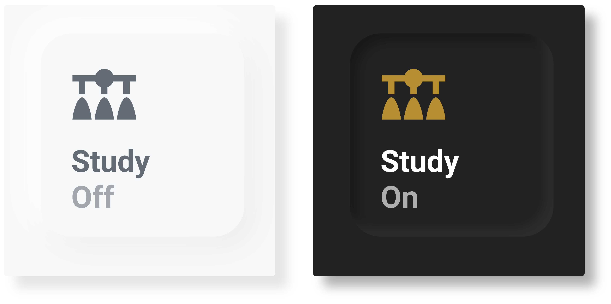

# Lovelace Soft UI


## Overview

This project originally stemmed from just me redoing my UI.
However, it has evolved into something much bigger.
Today, in this repo, you will find detailed instructions on applying
this style to your cards and a collection of custom-configured cards that match best with this style.

This would have not been possible without the support of the Home Assistant community.
If you need help, please consult the
[community forums](https://community.home-assistant.io/t/lovelace-soft-ui-simple-and-clean-lovelace-configuration)
or the issues tab. New contributions are most welcomed.
Thank you, and please check out other great alternatives:

- [**`Savjee`**](https://github.com/Savjee)/[`button-text-card`](https://github.com/Savjee/button-text-card)

- [**`KTibow`**](https://github.com/KTibow)/[`lovelace-soft-theme`](https://github.com/KTibow/lovelace-soft-theme/)

## Installation

First, we will need
[card-mod](https://github.com/thomasloven/lovelace-card-mod)
to style our cards. The easiest way to install card-mod is via
[HACS](https://hacs.xyz).

Second, we will need to apply our card-mod style through themes.
We first need to install custom themes (can also be found via HACS),
then we will add our card-mod style to the theme YAML files, typically found at:
`config/themes/{theme_name}/{theme_name}.yaml`

There are two ways to style our cards:
the Universal method, which styles _all_ cards,
and the Individual method, which only styles _specific_ cards.

#### `Universal`

To universally style all cards, add the following to your theme YAML file:

<details>
    <summary><i>Show code</i></summary>

**Light version:**

```yaml
# Example light_theme.yaml entry
theme_name:
  card-mod-theme: theme_name # Change to your theme name
  card-mod-card: |
    ha-card {
      margin: 20px;
      border-radius: 15px;
      background-color: var(--primary-background-color);
      box-shadow: -5px -5px 15px #ffffff, 5px 5px 15px #ebebeb;
    }
  # This is needed for the "pressed" buttons
  soft-ui-pressed: 'inset -4px -4px 5px #ffffff, inset 4px 4px 5px #ebebeb'
```

**Dark version:**

```yaml
# Example dark_theme.yaml entry
theme_name:
  card-mod-theme: theme_name # Change to your theme name
  card-mod-card: |
    ha-card {
      margin: 20px;
      border-radius: 15px;
      background-color: var(--primary-background-color);
      box-shadow: -5px -5px 15px #2c2c2c, 5px 5px 15px #191919;
    }
  # This is needed for the "pressed" buttons
  soft-ui-pressed: 'inset -4px -4px 5px #2c2c2c, inset 4px 4px 5px #191919'
```

</details>

#### `Individual`

To individually style cards,
first, we will create a styling class in our theme YAML:

<details>
    <summary><i>Show code</i></summary>

**Light version:**

```yaml
# Example light_theme.yaml entry
theme_name:
  card-mod-theme: theme_name # Change to your theme name
  card-mod-card: |
    ha-card.soft-ui {
      margin: 20px;
      border-radius: 15px;
      background-color: var(--primary-background-color);
      box-shadow: -5px -5px 15px #ffffff, 5px 5px 15px #ebebeb;
    }
  # This is needed for the "pressed" buttons
  soft-ui-pressed: 'inset -4px -4px 5px #ffffff, inset 4px 4px 5px #ebebeb'
```

**Dark version:**

```yaml
# Example dark_theme.yaml entry
theme_name:
  card-mod-theme: theme_name # Change to your theme name
  card-mod-card: |
    ha-card.soft-ui {
      margin: 20px;
      border-radius: 15px;
      background-color: var(--primary-background-color);
      box-shadow: -5px -5px 15px #2c2c2c, 5px 5px 15px #191919;
    }
  # This is needed for the "pressed" buttons
  soft-ui-pressed: 'inset -4px -4px 5px #2c2c2c, inset 4px 4px 5px #191919'
```

</details>

Then to use the style, simply reference the `soft-ui` class in any card
by adding the following to the YAML card configuration:

```yaml
# Example card configuration entry
card_mod:
  class: soft-ui
```

## Cards

All cards below have been made to work with both
the Universal styling method and the Individual styling method.
However, Button cards **require** the additional installation of the custom
[button-card](https://github.com/custom-cards/button-card).
Add cards via the _Manual_ card option in the Lovelace UI.

#### `Heading`

> Get card [here](cards/text/heading.yaml)


#### `Heading & Subheading`

> Get card [here](cards/text/heading_subheading.yaml)


#### `Button`

> Get card [here](cards/button/button.yaml)


#### `Button Border`

> Get card [here](cards/button/button_border.yaml)


#### `Button Text`

> Get card [here](cards/button/button_text.yaml)



#### `Button Border Text`

> Get card [here](cards/button/button_border_text.yaml)


#### `Button Description`

> Get card [here](cards/button/button_description.yaml)


